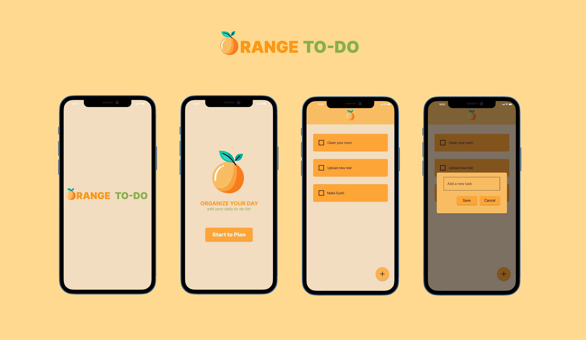

<h1 align="center">ORANGE TO-DO 🍊</h1>
<p align="center">  
This simple To-Do application is a useful tool for organizing your daily tasks. You can easily add, edit, and delete items from the to-do list. Also, your data is securely stored using the Hive database, ensuring that you always have access to up-to-date information about your tasks.
  </p>

## APP


## Installation

1. Create a new Flutter project:
  ```shell
  flutter create orange-todo
  ```

2. Clone the repository:
  ```shell
  git clone https://github.com/GunseliUnsal/orange-todo.git
  ```

3. Test your changes by running the app on an emulator or a physical device:
  ```shell
  flutter pub get
  flutter run
  ```
